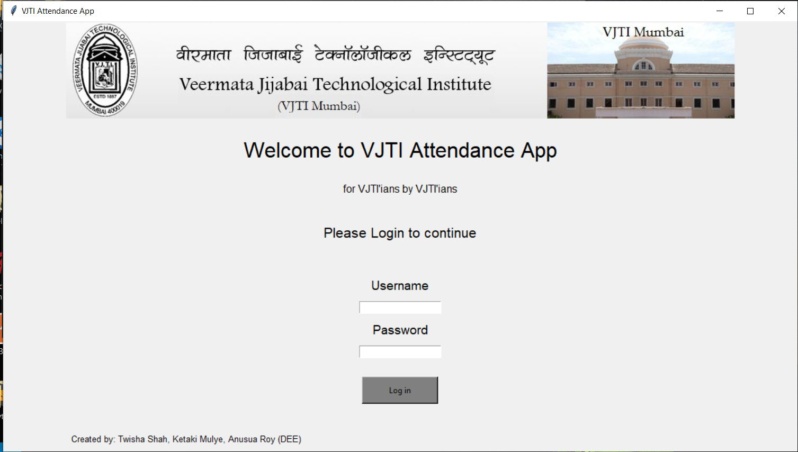

 
<h1>LOGIN AND ATTENDANCE SYSTEM USING PYTHON</h1>
<!-- TABLE OF CONTENTS -->

  
Table of Contents

  <ol>
    <li><a href="#about-the-project">About The Project</a></li>
    <li><a href="#built-with">Built with</a></li>
    <li><a href="#key-features">Key Features</a></li>
    <li><a href="#project-demo">Project Screenshots</a></li>
    <li><a href="#license">License</a></li>
    </ol>

<!-- ABOUT THE PROJECT -->

# About The Project
  

    

 This new form of attendance system will greatly reduce the workload of the faculty members and save the extra time and efforts needed to file and manually update the months and months of attendance records of individual students.
It also helps in reducing the amount of errors caused during manually updating the attendance from one file to another making the ‘Attendance System’ a very efficient means.
  

  
  <!-- Built With -->

# Built With
  

    <ul>
      <li>Python-3</li>
      <li>Tkinter Library for Python</li>
    </ul>
  

  
  
  
 <!-- PROJECT DEMO -->
# Project Screenshots
  

    

      
       
      
  

<!-- BUILT WITH -->

